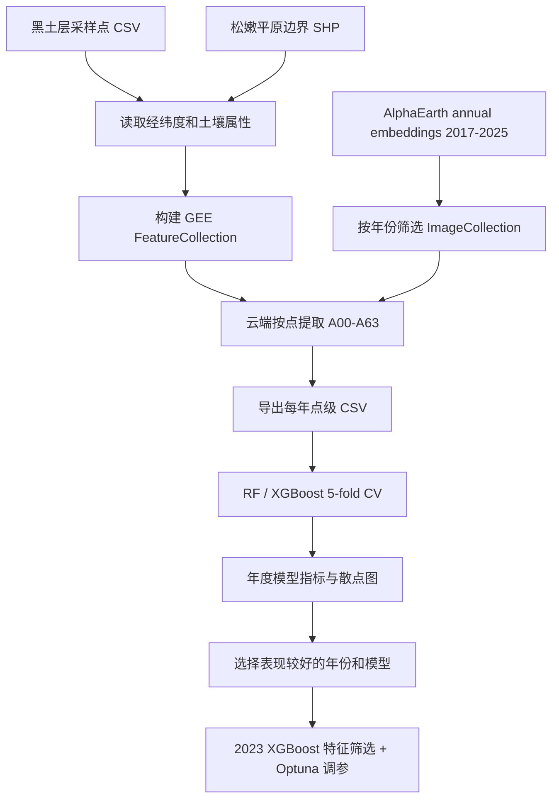

# AlphaEarth 黑土层属性反演项目说明

## 1. 项目目标

本项目尝试使用 Google Earth Engine 中的 **AlphaEarth Foundations annual satellite embeddings** 作为遥感特征，对黑土层采样点的土壤属性进行机器学习回归建模。

预测目标包括 5 个土壤指标：

- `pH值`
- `全碳(g/kg)`
- `有机碳(g/kg)`
- `容重(g/cm3)`
- `N(g/kg)`

研究区为松嫩平原范围：

```text
data/songnen_plain/songnen_wgs84.shp
```

采样数据为：

```text
data/黑土层采样数据/黑土层采样数据.csv
```

样点数量为 202 个。每个样点包含经纬度坐标和上述 5 个土壤属性。

## 2. 数据来源

### 2.1 地面采样数据

采样数据来自本地 CSV，核心字段包括：

- 坐标字段：`经度`、`纬度`
- 土壤属性字段：`pH值`、`全碳(g/kg)`、`有机碳(g/kg)`、`容重(g/cm3)`、`N(g/kg)`

脚本会先用松嫩平原边界筛选样点。当前 202 个样点均落在研究区内。

### 2.2 AlphaEarth Foundations 数据

GEE 数据集：

```text
GOOGLE/SATELLITE_EMBEDDING/V1/ANNUAL
```

该 annual collection 当前包含年份：

```text
2017, 2018, 2019, 2020, 2021, 2022, 2023, 2024, 2025
```

每一年包含 64 个 embedding bands：

```text
A00, A01, ..., A63
```

这些 band 不是传统光谱波段，而是 AlphaEarth 模型从多源遥感数据中学习得到的地表表征特征。

## 3. 技术路线

本项目不下载研究区整幅 64-band raster。原因是松嫩平原范围较大，10 m 分辨率下体量很大，直接下载整区影像不适合当前点位回归任务。

实际采用的路线是：**在 GEE 云端按采样点提取 AlphaEarth 64 个 band 的值，只导出点级特征表，再在本地训练模型**。

流程如下：



## 4. 数据处理与特征导出

使用脚本：

```text
alphaearth/download_alphaearth_2018.py
```

虽然脚本名保留了 `2018`，目前已经支持通过 `--year` 参数导出任意年份。

示例：

```bash
cd alphaearth
../.venv/bin/python download_alphaearth_2018.py --project ee-cxshfdj --year 2023 --skip-preview
```

导出的点级特征 CSV 位于：

```text
alphaearth/data/alphaearth_2017_sample_embeddings.csv
...
alphaearth/data/alphaearth_2025_sample_embeddings.csv
```

每个 CSV 的结构为：

- 样点信息：`样点`、`点号`、`经度`、`纬度`
- 目标变量：5 个土壤属性
- AlphaEarth 特征：`A00` 到 `A63`

每个年份均为 202 行、73 列。

## 5. 模型方案

### 5.1 单目标建模

当前采用 **每个土壤指标单独训练一个模型** 的方案，而不是一个模型同时预测 5 个指标。

也就是说：

- `pH值` 单独训练一套模型
- `全碳(g/kg)` 单独训练一套模型
- `有机碳(g/kg)` 单独训练一套模型
- `容重(g/cm3)` 单独训练一套模型
- `N(g/kg)` 单独训练一套模型

这样做的原因是各指标量纲、分布和最佳超参数不同。单目标建模更便于调参、解释和比较。

### 5.2 交叉验证

模型评估使用随机 5 折交叉验证：

```python
KFold(n_splits=5, shuffle=True, random_state=42)
```

每个样点都会在某一折中作为验证样本被预测一次。最终使用所有 out-of-fold predictions 计算：

- `R2`
- `RMSE`
- `MAE`

需要注意：当前是随机交叉验证，没有做 spatial cross-validation。如果样点存在空间聚集，随机 CV 指标可能偏乐观。

### 5.3 Random Forest

RF 脚本：

```text
alphaearth/train_alphaearth_soil_models_rf.py
```

核心参数：

```python
RandomForestRegressor(
    n_estimators=500,
    min_samples_leaf=3,
    random_state=42,
    n_jobs=-1,
)
```

### 5.4 XGBoost

XGBoost 脚本：

```text
alphaearth/train_alphaearth_soil_models_xgboost.py
```

核心参数：

```python
XGBRegressor(
    n_estimators=400,
    max_depth=3,
    learning_rate=0.03,
    subsample=0.8,
    colsample_bytree=0.8,
    min_child_weight=3,
    reg_alpha=0.1,
    reg_lambda=2.0,
    objective="reg:squarederror",
    random_state=42,
    n_jobs=-1,
    tree_method="hist",
)
```

### 5.5 年度对比

年度批处理脚本：

```text
alphaearth/train_yearly_rf_xgboost.py
```

运行后会对 2017-2025 年每一年分别训练 RF 和 XGBoost，并输出：

```text
alphaearth/outputs_yearly/{year}/rf/
alphaearth/outputs_yearly/{year}/xgboost/
```

每个目录包含：

- `model_metrics.csv`
- `cross_validated_predictions.csv`
- `observed_vs_predicted.png`
- `observed_vs_predicted.pdf`

年度汇总表：

```text
alphaearth/outputs_yearly/yearly_model_metrics.csv
alphaearth/outputs_yearly/best_year_by_model_target.csv
```

年度 R2 热图：

```text
alphaearth/outputs_yearly/rf_yearly_r2_heatmap.png
alphaearth/outputs_yearly/xgboost_yearly_r2_heatmap.png
```

## 6. 2023 年 XGBoost 优化

年度对比显示，2021-2023 年整体表现较好，其中 2023 年 XGBoost 在多个指标上表现突出。因此进一步对 2023 年 XGBoost 做了优化。

优化脚本：

```text
alphaearth/tune_2023_xgboost_optuna.py
```

优化策略：

1. 使用 `SelectKBest` 做特征预筛选。
2. 特征评分函数使用 `mutual_info_regression`。
3. 使用 `Optuna` 的 TPE sampler 进行贝叶斯超参数搜索。
4. 每个目标变量单独搜索参数。
5. 每个 trial 使用 5-fold CV，以 RMSE 最小为目标。

搜索空间包括：

- `k_features`
- `n_estimators`
- `max_depth`
- `learning_rate`
- `subsample`
- `colsample_bytree`
- `min_child_weight`
- `gamma`
- `reg_alpha`
- `reg_lambda`

优化结果输出目录：

```text
alphaearth/outputs_yearly/2023/xgboost_optuna/
```

包括：

- `model_metrics.csv`
- `best_params.json`
- `selected_features.csv`
- `cross_validated_predictions.csv`
- `observed_vs_predicted.png`
- `observed_vs_predicted.pdf`
- `optuna_trials_*.csv`

## 7. 主要结果

### 7.1 年度最佳结果

按 `R2` 选择每个模型和指标的最佳年份：

| model | target | best year | R2 | RMSE | MAE |
|---|---|---:|---:|---:|---:|
| RF | pH值 | 2023 | 0.273 | 0.599 | 0.474 |
| RF | 全碳(g/kg) | 2023 | 0.309 | 11.570 | 7.966 |
| RF | 有机碳(g/kg) | 2019 | 0.271 | 9.008 | 6.335 |
| RF | 容重(g/cm3) | 2022 | 0.087 | 0.166 | 0.130 |
| RF | N(g/kg) | 2023 | 0.331 | 0.849 | 0.612 |
| XGBoost | pH值 | 2023 | 0.385 | 0.551 | 0.434 |
| XGBoost | 全碳(g/kg) | 2021 | 0.377 | 10.980 | 8.068 |
| XGBoost | 有机碳(g/kg) | 2021 | 0.295 | 8.858 | 6.642 |
| XGBoost | 容重(g/cm3) | 2022 | 0.135 | 0.162 | 0.127 |
| XGBoost | N(g/kg) | 2018 | 0.339 | 0.844 | 0.607 |

总体上，`2021-2023` 年的 AlphaEarth features 表现相对更好。

### 7.2 2023 XGBoost 调参结果

2023 年 XGBoost 原始参数与 Optuna 优化后的结果对比：

| target | 原 R2 | 优化后 R2 | Delta R2 | 原 RMSE | 优化后 RMSE |
|---|---:|---:|---:|---:|---:|
| pH值 | 0.385 | 0.372 | -0.012 | 0.551 | 0.557 |
| 全碳(g/kg) | 0.325 | 0.419 | +0.094 | 11.428 | 10.604 |
| 有机碳(g/kg) | 0.239 | 0.336 | +0.097 | 9.203 | 8.594 |
| 容重(g/cm3) | 0.042 | 0.056 | +0.015 | 0.170 | 0.169 |
| N(g/kg) | 0.264 | 0.372 | +0.108 | 0.891 | 0.823 |

优化后，`全碳(g/kg)`、`有机碳(g/kg)` 和 `N(g/kg)` 提升明显；`pH值` 略低于原始 2023 XGBoost；`容重(g/cm3)` 仍然较弱。

## 8. 图件输出

散点图采用科研配图风格：

- 多面板布局
- panel labels
- 1:1 reference line
- OLS fit line
- 图内标注 `R2`、`RMSE`、`MAE`
- 输出 600 dpi PNG 和 PDF

关键图件示例：

```text
alphaearth/outputs_yearly/2023/xgboost/observed_vs_predicted.png
alphaearth/outputs_yearly/2023/xgboost_optuna/observed_vs_predicted.png
alphaearth/outputs_yearly/xgboost_yearly_r2_heatmap.png
```

## 9. 当前结论

1. AlphaEarth annual embeddings 可以为黑土层属性提供一定预测能力，但不同指标差异明显。
2. `全碳(g/kg)`、`有机碳(g/kg)`、`N(g/kg)` 的建模效果相对较好。
3. `容重(g/cm3)` 的预测效果弱，说明仅依赖 AlphaEarth embeddings 很难充分解释该指标。
4. 年份上，2021-2023 整体优于其他年份。
5. XGBoost 通常优于 RF，尤其是在特征筛选和贝叶斯调参后。
6. 2023 年 XGBoost + Optuna 对碳、氮相关指标提升明显。

## 10. 方法学限制与后续改进

当前结果适合作为探索性建模结果，但距离严格论文结论仍有几个限制：

1. **随机 CV 可能高估泛化能力**  
   当前使用随机 5-fold CV，没有考虑空间自相关。后续建议使用 spatial block CV 或按行政区/空间网格分组的 `GroupKFold`。

2. **Optuna 调参和最终评估使用同一套 CV**  
   这会带来一定选择偏差。严格评估应使用 nested CV 或独立 test set。

3. **特征来源单一**  
   当前只使用 AlphaEarth 64 个 embedding bands。后续可加入 DEM、slope、climate、land cover、土壤类型、经纬度等辅助变量。

4. **目标变量分布未做变换**  
   `全碳`、`有机碳`、`N` 存在高值尾部。后续可尝试 `log1p(y)`、winsorization 或 robust objective。

5. **没有做空间制图**  
   当前只完成点位回归。如果要生成研究区连续预测图，需要把最优模型应用到 raster feature stack，并处理空间分块预测、投影、nodata 和输出栅格。

## 11. 复现命令

创建并使用项目内虚拟环境后，可按以下顺序复现。

导出某一年 AlphaEarth 点级特征：

```bash
cd /Users/levi/data/work/black-soil/alphaearth
../.venv/bin/python download_alphaearth_2018.py --project ee-cxshfdj --year 2023 --skip-preview
```

批量训练年度 RF 和 XGBoost：

```bash
../.venv/bin/python train_yearly_rf_xgboost.py --years 2017 2018 2019 2020 2021 2022 2023 2024 2025
```

优化 2023 年 XGBoost：

```bash
../.venv/bin/python tune_2023_xgboost_optuna.py --trials 80
```

